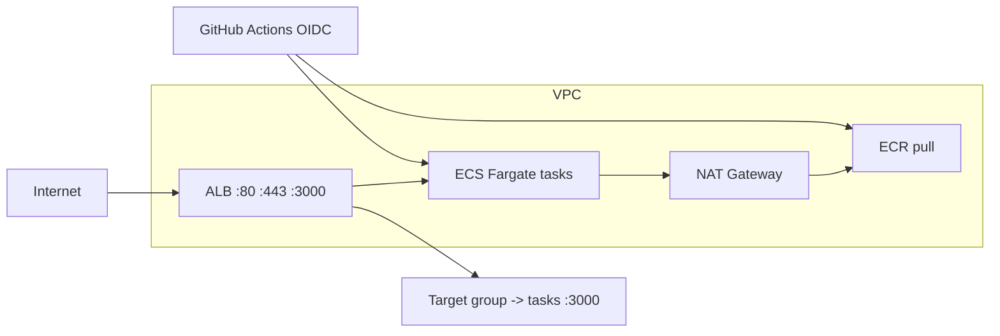

# ECS on Fargate with ALB, ECR, and GitHub Actions

Terraform creates a **modular** stack: VPC (public + private subnets, single NAT), **ECR**, **Application Load Balancer** (listeners **80**, **3000**, and optional **443**), **ECS Fargate** service behind the ALB, and an **IAM role** for GitHub Actions (OIDC) to push images and roll the service.

Your application stays in its own GitHub repository. Copy the workflow from `.github/workflows/deploy-ecs.yml` into that repo (or use this repo as a template and add your app here), build a **Docker** image on each push to `main`, push to ECR, and run `aws ecs update-service --force-new-deployment`.

## Architecture



- **ALB** security group allows **80**, **443**, and **3000** from `0.0.0.0/0`. Listeners **80** and **3000** forward HTTP to the target group; **443** is created only if you set `acm_certificate_arn` (ACM must be in the **same region** as the ALB).
- **Tasks** run in **private** subnets; only **container port 3000** (configurable) accepts traffic from the ALB security group. Outbound traffic uses the NAT gateway (for ECR pulls and image layers).

## Prerequisites

- Terraform `>= 1.0`, AWS CLI configured with credentials that can create the resources in this stack.
- A **Dockerfile** at the repository root (or change the `docker build` path in the workflow). The container should **listen on the same port** as `container_port` (default **3000**). The ALB health check uses `health_check_path` (default **`/`**); return **HTTP 200–399** when healthy.
- For **HTTPS (443)**: request or import an **ACM** certificate in the chosen `aws_region` and set `acm_certificate_arn` in `terraform.tfvars`.

## Terraform usage

1. Copy `terraform.tfvars.example` to `terraform.tfvars` and set at least `github_org`, `github_repo`, and optionally `name_prefix`, `aws_region`, `acm_certificate_arn`, `container_port`, `health_check_path`.

2. Initialize and apply:

   ```bash
   terraform init
   terraform plan
   terraform apply
   ```

3. Note outputs:

   - `alb_dns_name` — open `http://<dns>/` (port 80) or `http://<dns>:3000/` depending on listener.
   - `ecr_repository_url`, `ecs_cluster_name`, `ecs_service_name` — used for CI and debugging.
   - `github_actions_role_arn` — used as the GitHub Actions **secret** below.

### GitHub OIDC provider (one per AWS account)

If `terraform apply` fails because an OIDC provider for `token.actions.githubusercontent.com` already exists, set `create_github_oidc_provider = false` in `terraform.tfvars` and apply again. Terraform will **reference** the existing provider instead of creating a duplicate.

## GitHub Actions (application repository)

Use **`.github/github-actions.env.example`** as a checklist: same names as GitHub Secrets/Variables, empty values so you can paste from `terraform output` when you are ready (nothing in that file is read by Terraform or the workflow automatically).

In the repo that contains your **Dockerfile** and app code:

1. **Repository secret** (Settings → Secrets and variables → Actions → **Secrets**):

   - `AWS_ROLE_TO_ASSUME` = Terraform output `github_actions_role_arn`.

2. **Repository variables** (Settings → Secrets and variables → Actions → **Variables**), matching your Terraform outputs:

   | Variable            | Example source                          |
   | ------------------- | --------------------------------------- |
   | `AWS_REGION`        | Same as `var.aws_region`                |
   | `ECR_REPOSITORY`    | Output `ecr_repository_name`            |
   | `ECS_CLUSTER_NAME`  | Output `ecs_cluster_name`               |
   | `ECS_SERVICE_NAME`  | Output `ecs_service_name`               |

3. Add the workflow file `.github/workflows/deploy-ecs.yml` (from this project) to the **default branch** configured in Terraform (`github_branch`, default `main`).

4. Push to `main` (or run **workflow_dispatch**). The job builds the image, tags it as `latest` and `<git-sha>`, pushes to ECR, and forces a new ECS deployment.

**First deploy:** Until at least one image exists in ECR, ECS tasks may fail to start. Run the workflow once (or `docker push` manually) after `terraform apply`.

### Workflow failed: `Input required and not supplied: aws-region`

That means **`AWS_REGION` is not set as a repository Variable** in the repo where the workflow runs (empty `vars.AWS_REGION`). Add all five items from `.github/github-actions.env.example` in **Settings → Secrets and variables → Actions** — one **Secret** and four **Variables** (not secrets). Values come from `terraform output` after `terraform apply`.

## Module layout

| Module          | Responsibility                                                |
| --------------- | ------------------------------------------------------------- |
| `modules/vpc`   | VPC, public/private subnets, IGW, single NAT, route tables    |
| `modules/ecr`   | ECR repository, scan on push, lifecycle policy                |
| `modules/alb`   | ALB, target group, SG, listeners 80 / 3000 / optional 443    |
| `modules/ecs`   | ECS cluster, Fargate task definition, service, logs, IAM      |
| `modules/github_oidc` | GitHub OIDC provider (optional) + deploy IAM role     |

## State and migration note

If this directory previously applied other resources (for example an S3 drift lab), **migrate or use a fresh backend/state** before applying this stack so you do not destroy unrelated resources by mistake.

## Cleanup

```bash
terraform destroy
```

Destroy order may take several minutes (ALB, NAT, ECS draining).
